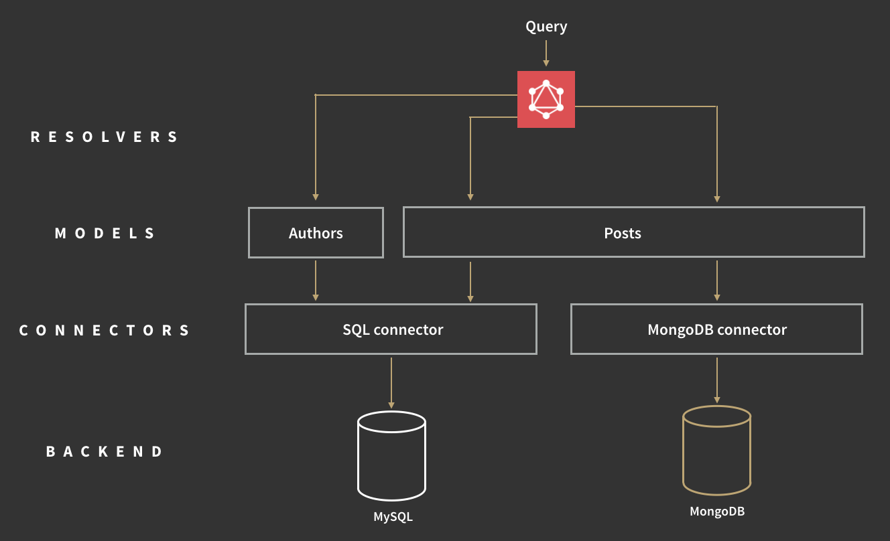

# Connectors and models

* **Connector:** a layer on top of a database/backend driver that has GraphQL-specific error handling, logging, batching, and/or caching. Only needs to be implemented once for each backend, can be reused in many apps

* **Model:** a set of functions to fetch data of a certain GraphQL type by using various connectors. Models are usually application-specific.

This document is intended as a design document for people who want to write connectors for various backends. Its main purpose is to specify what properties connectors should have so they can be easily shared with other people and used in Apollo without any shims.

This is a draft at the moment, and not the final document. Chances are that the spec will change as we learn about the better ways to build GraphQL servers. It should be pretty close to the final version though, so if you want to get started and build connectors for specific backends, this document is a good starting point.


Technically you could write a GraphQL server without connectors and models by writing all your logic directly into the resolve functions, but in most cases that's not ideal. Connectors and models are a way of organizing code in a GraphQL server, and you should use them to keep your server modular. If the need arises, you can always write optimized queries directly in your resolvers or models.

Let's use an example schema, because it's always easier to explain things with examples:
```
type Author {
  id: ID!
  name: String
  posts: [Post]
}

type Post {
  id: ID!
  title: String
  text: String
  views: Int
  author: Author
}

type Query {
  author(id: ID!): Author
  searchPosts(titleContains: String): [Post]
}
```

In this example, an author has multiple posts, and each post has one author.

Here's an illustration for how connectors and models would look like for this example if Authors and Posts were stored in MySQL, but view counts in MongoDB:




The Posts model connects to both SQL and MongoDB. Title, text and authorId come from SQL, the view count comes from MongoDB.


## What is a connector?

A connector is the piece of code that links a GraphQL server to a specific backend (eg. MySQL, MongoDB, S3, neo4j). Each backend will have its own connector. Apart from connecting the GraphQL server to a backend, connectors should also:

- Batch requests together whenever it makes sense
- Cache data fetched for the backend to avoid extra requests (at least for the duration of one query)
- Provide a way to log information about data fetched, such as how long the request took, which things were batched together, what was fetched from the cache, how much data was fetched etc.

Both batching and caching are more important in GraphQL than in traditional endpoints, because one GraphQL query may make many separate calls to the backend to retrieve all the items where a REST endpoint would only retrieve a few items, usually in one query. The separate calls let GraphQL support a wide range of queries, whereas a single REST endpoint typically only allows querying for a narrow set of objects.


## What is a model?

Models are the glue between connectors - which are backend-specific - and GraphQL types - which are app-specific. They are very similar to models in ORMs, such as Rails' Active Record.

Let's say for example that you have two types, Author and Post, which are both stored in MySQL. Rather than calling the MySQL connector directly from your resolve funcitons, you should create models for Author and Post, which use the MongoDB connector. This additional level of abstraction helps separate the data fetching logic from the GraphQL schema, which makes reusing and refactoring it easier.

In the example schema above, the Authors model would have the following methods:
```
const Author = {
  getById(id); // get an Author by id.
}
```

The Posts model would have the following methods:
```
const Posts = {
  getById(id); // get Post by id
  getByTitleContains(contains); //get a list of posts that have a word in the title
  getByAuthor(authorId); // get list of posts by a certain author
  views(postId); // get the number of views for post with ID postId (fetches from MongoDB)
}
```

In some cases it may be a good idea for your `getById` (and other) methods to take the list of fields to be fetched as an additional argument. That way the model layer can make sure to fetch only the data required from the backend. This is especially important for types that have large fields which are not always required.


## How to use connectors and models in Apollo Server
note: This is a still a draft design document. At the time of writing there are no connectors. As we build connectors, we'll add them to the docs.

Connectors and models are easy to use in apollo server:

Step 1: Import the connector and the DB driver
```
import MongoDBConnector from 'apollo-connector-mongodb';
import pmongo from 'promised-mongo';
import knex from 'knex';
```

Step 2: Establish a connection with the DB
```
const mongoDB = pmongo('username:password@localhost:27017/blog');
const sqlDB = knex({ dialect: 'sqlite3', connection: { filename: './blog.sqlite' } });
```

Step 3: Create the model
```
class Author {
  constructor({connector}){
    this.connector = connector;
  }
  getById(id){
    return this.connector.findOne({ _id: id });
  }
}
```

Step 4: Adding models to the context
```
app.use('/graphql', apolloServer({
  schema: Schema,
  connectors: {
    mongo: new MongoDBConnector(mongoDB),
    sql: new SqlConnector(sqlDB)
  },
  models: {
    Author: new Author({ db: 'sql' }),
    Post: new Post({ postDb: 'sql', viewsDb: 'mongo' }),
  }
});
```

Step 4: Calling models in resolve functions
```
function resolve(author, args, ctx){
  return ctx.models.Post.getByAuthor(author.id);
}
```

## FAQ


**Question:** Are models the same as GraphQL types?
**Answer:** There will usually be a 1:1 correspondence between types in your schema and the models, so it makes sense to keep them in the same file, or at least in the same folder. The subtle difference is that while the GraphQL schema describes the types and their relationships, the models define which connectors should be used to fetch the actual data for that type.

**Question:** Can I use \<Mongoose/Sequelize/MyOtherFavoriteORM\> with Apollo Server?
**Answer:** Yes, you can use an existing ORM if you wish. In that case, the models you use will be your ORM's models, and the connector part will be in the ORM itself. Most ORMs don't implement batching and caching, but in the future there should be connectors that work with various ORMs so developers don't need to worry about batching and caching, and can keep using the ORM of their choice. In the meantime you can always start without batching and caching, and then add it manually where necessary (just as you might write an optimized raw query when using your ORM now).
